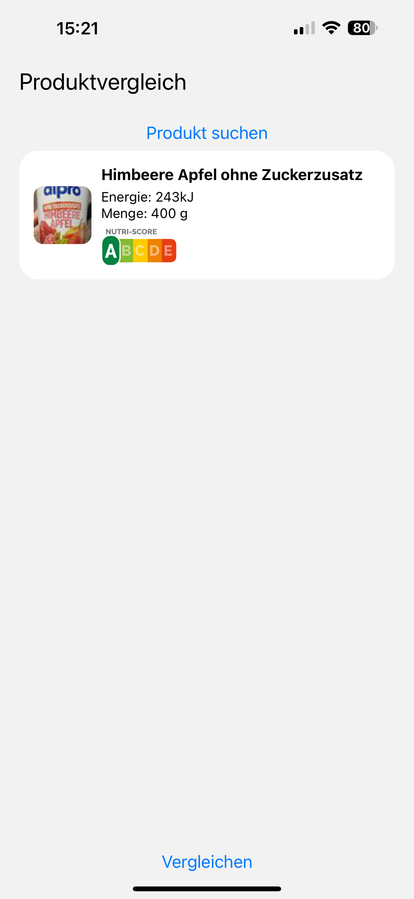
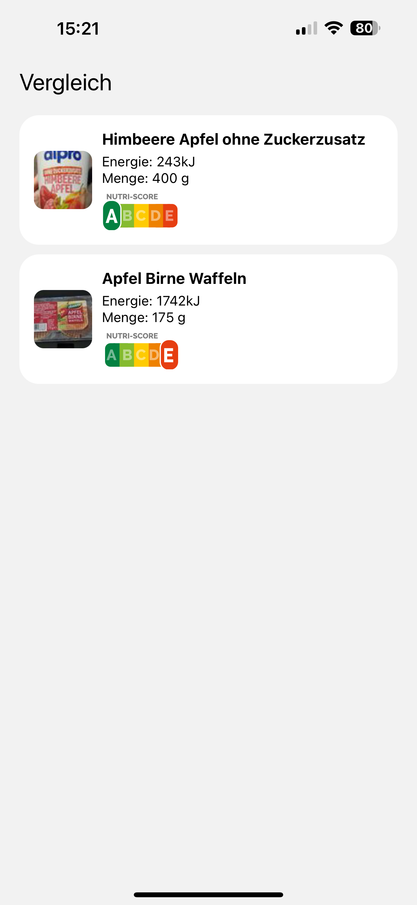
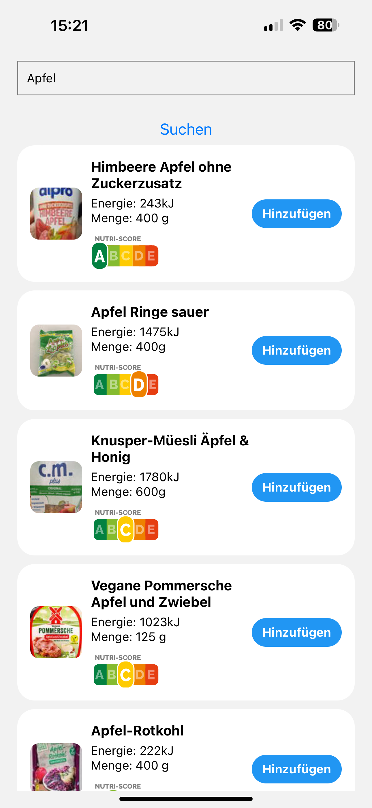

# Food Comparison App

This is a mobile application built with React Native and Expo that allows users to compare food items based on their Nutri-Score.

## Features

- View and compare food items by their Nutri-Score.
- Search for new food items and add them to the comparison list.
- Simple and intuitive user interface.

## Technologies Used

- React Native
- Expo
- JavaScript
- [Open Food Facts API](https://world.openfoodfacts.org/data)
- Expo Router for navigation

## Installation

To run this project locally, make sure you have Node.js, Expo CLI, and a mobile emulator or a physical device with the Expo Go app installed.

1. Clone the repository:

   ```bash
   git clone https://github.com/einslucaaa/food-comparison-app.git
   ```

2. Navigate into the project directory:

   ```bash
   cd food-comparison-app
   ```

3. Install dependencies:

   ```bash
   npm install
   ```

4. Start the Expo development server:

   ```bash
   npx expo start
   ```

5. Follow the instructions in the terminal to open the app on your emulator or device using the Expo Go app.

## Usage

- On the Home screen, view a list of food items currently in the comparison.
- Add new food items by searching using the provided search functionality.
- Compare food items by their Nutri-Score.
- Navigate between screens using the bottom navigation or swipe gestures.

## Screenshots





## Contributing

Contributions are welcome! Please fork the repository and create a pull request with your improvements.

## License

This project is licensed under the MIT License - see the [LICENSE](LICENSE) file for details.

## Acknowledgments

- Thanks to [Open Food Facts](https://world.openfoodfacts.org/) for providing food data and Nutri-Score information.
